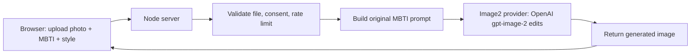

# Architecture

## Flow

## Why image-to-image

The product needs to preserve the user's facial identity while transforming the visual language into an original MBTI persona. That maps to an image editing/reference-image workflow, not pure text-to-image generation.

## Provider boundary

`server.js` keeps the provider call isolated in `generateImage2Image()`. Today it supports OpenAI `gpt-image-2`; future providers can be added behind the same function or moved into separate modules:

- OpenAI GPT Image 2 for high-fidelity image-to-image portraits.
- Liblib / LibTV for China-market creative workflows.
- Replicate, Fal.ai, or self-hosted ComfyUI for model experimentation.

## Open-source deployment shape

For a public SaaS version, split the MVP into:

- Web app: Next.js or the current static frontend.
- API: Node service with queue-backed generation.
- Queue: BullMQ, Cloudflare Queues, or managed background jobs.
- Storage: S3/R2/Supabase Storage with short retention.
- Database: Postgres for users, jobs, quotas, and asset metadata.
- Observability: Sentry for errors and PostHog for privacy-aware product analytics.
